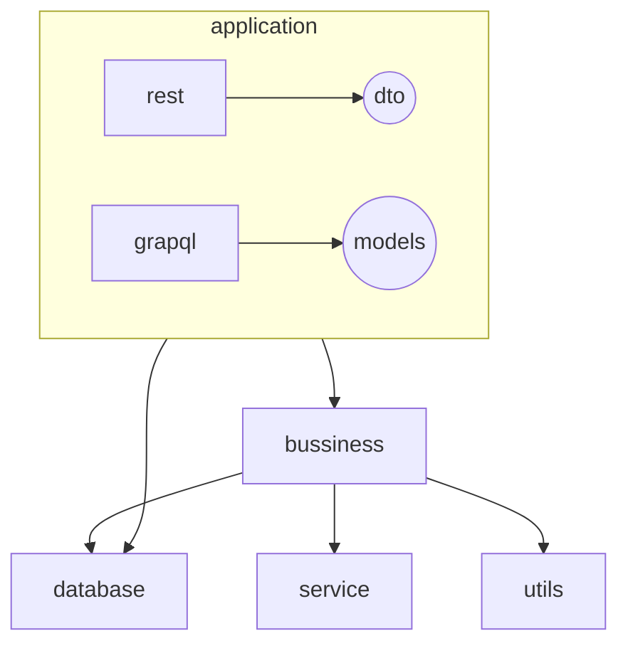

# Proyecto Backend

## Contexto del proyecto

Este proyecto es un backend creado con Nestjs 11.0.1 el cual trabaja con las siguinetes dependencias como base

*   apollo-server-core
*   apollo-server-express
*   axios
*   dd-trace
*   graphql
*   graphql-subscriptions
*   graphql-type-json
*   graphql-ws
*   html-pdf-node
*   inline-css
*   log4js
*   md-to-pdf
*   passport
*   passport-github
*   passport-google-oauth20
*   passport-jwt
*   passport-local
*   puppeteer
*   qrcode
*   reflect-metadata
*   rxjs
*   speakeasy
*   subscriptions-transport-ws
*   telegraf
*   uuid
*   vm2

Este proyecto tiene como objetivo crear servicios REST y Graphql, estructurados como monorepo, utilizando como ORM prisma

## Estructura de carpetas

*   El proyecto está configurado como monorepo
*   Los proyectos se deben crear dentro de la carpeta **apps**
*   Cada proyecto contiene una carpeta /src/`applications el cual puede tener uno de estas 2 carpetas o ambas`
    *   `rest: Carpeta que contiene clases @Controller`
    *   `graphql: Carpeta que contiene clases @Resolver`
*   Existe una librería compartida llamada common ubicada en /libs/common

jjvsolution-back-mp

```
├─ apps # Carpeta de proyectos del monorepo 
│  ├─ access-control # Proyecto de access control
│  │  ├─ src
│  │  │  └─ applications
│  │  │     ├─ graphql
│  │  │     │  └─ models
│  │  │     └─ rest
│  │  └─ test
│  ├─ admin
│  │  ├─ src
│  │  └─ test
│  ├─ jjvsolution-back-mp
│  │  ├─ src
│  │  └─ test
│  ├─ landing
│  │  ├─ src
│  │  └─ test
│  ├─ payment-portal
│  │  ├─ src
│  │  │  └─ applications
│  │  │     └─ graphql
│  │  │        └─ models
│  │  └─ test
│  └─ quotation
│     ├─ src
│     │  └─ applications
│     │     └─ graphql
│     │        └─ models
│     └─ test
├─ documentation # Carpeta para la documentación del proyecto
├─ libs # Librería del monorepo el cual se comparte para todos los proyectos
│  └─ common # Librería Común y transversal
│     └─ src # Carpeta raíz de  la librería common
│        ├─ business # Carpeta que contiene la lógica del negocio para cada proyecto
│        │  ├─ access-control # Carpeta que contiene la lógica del negocio para cada access-control
│        │  ├─ generic # Carpeta que contiene la lógica del negocio para cada generic
│        │  └─ quotation # Carpeta que contiene la lógica del negocio para cada quotation
│        ├─ config # Carpeta de configuración transversal para NestJS
│        │  ├─ constants # Constantes transversales
│        │  ├─ cross # Carpeta que contiene características específicas de NestJS transversales
│        │  │  ├─ exceptions # exceptions personalizados para NestJS
│        │  │  ├─ guards # guards personalizados para NestJS
│        │  │  ├─ handdles # handdles personalizados para NestJS
│        │  │  ├─ interceptors # interceptors personalizados para NestJS
│        │  │  ├─ pipes # pipes personalizados para NestJS
│        │  │  ├─ strategies # strategies personalizados para NestJS
│        │  │  └─ strategy # strategy personalizados para NestJS
│        │  └─ factories # factories personalizados para NestJS
│        ├─ database # Carpeta para administras las coenxiones de BD
│        │  ├─ mongo # Carpeta para administrar conexiones con ORM Mongo
│        │  │  ├─ repositories # Carpeta para la capa de repositorio
│        │  │  └─ schemas
│        │  └─ prisma # Carpeta para administrar conexiones con ORM Prisma
│        │     ├─ access-control # Carpeta para la capa de repositorio de access-control
│        │     ├─ payment-portal # Carpeta para la capa de repositorio de payment-portal
│        │     └─ quotation # Carpeta para la capa de repositorio de quotation
│        ├─ dto # Carpeta con DTO de NestJS
│        ├─ interfaces # Carpeta transversal de intgerfaces de Typescript
│        │  ├─ config # Interfaces para configuraciones
│        │  ├─ services # Interfaces para servicios
│        │  └─ strategy # Interfaces para strategy
│        ├─ services # Carpeta para consumos de servicios externos
│        ├─ shared # Carpeta de módulos compartidos
│        │  ├─ graphQLPlugins # Plugin para Graphql
│        │  └─ log4js # módulo de Logs
│        └─ utils # Utilidades compartidas
└─ prisma # Carpeta de prisma que contiene toda la información y configuración de la base de datos por el ORM de prisma 
```

## Reglas del proyecto

EL proyecto debe tener seguir la siguientes estructuras para la creación de un servicio, ya sea Rest o Graphql



## Base de datos

*   El proyecto soporta utilizar ORM Mongoose o Prisma
*   Este proyecto actualmente solo está utilizando prisma con Postgresql
*   La configuración de prisma se encuentra en prisma/schema.prisma
*   La capa de repositorio donde se enceuntra el manejo de consultas sql dentro de la carpeta libs/common/src/database/prisma donde se encuentra separado por proyectos o transversales
*   La estructura base de un repositorio es:

```typescript
import { Injectable } from '@nestjs/common';
import { Prisma } from '@database/prisma';

@Injectable()
export class {{NOMBRE_CLASE}}Repository {
  constructor(private readonly prisma: Prisma) {}
  get db() {
    return this.prisma.{{NOMBRE_TABLE}};
  }
}
```

## Creación de servicio REST

## Creación de servicio Graphql